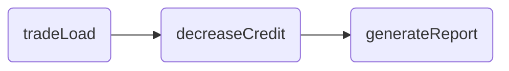

## Trade Job

### About

The goal is to show a reasonably complex scenario, that would
resemble the real-life usage of the framework.

This job has 3 steps:



First, data about trades are imported from a
file to database. Second, the trades are read from the database and
credit on customer accounts is decreased appropriately. Last, a
report about customers is exported to a file.

## Run the sample

You can run the sample from the command line as following:

```
$>cd spring-batch-samples
$>../mvnw -Dtest=TradeJobFunctionalTests#testLaunchJob test
```